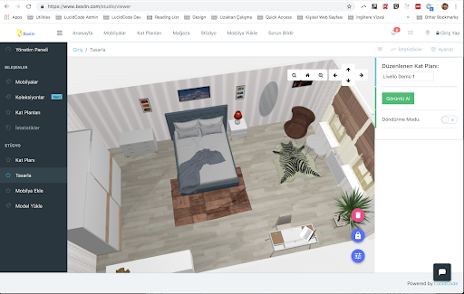
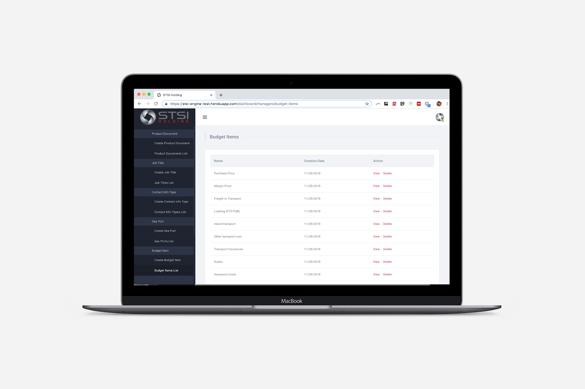
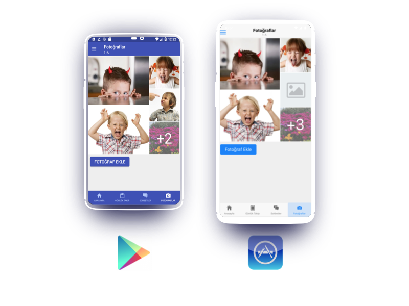
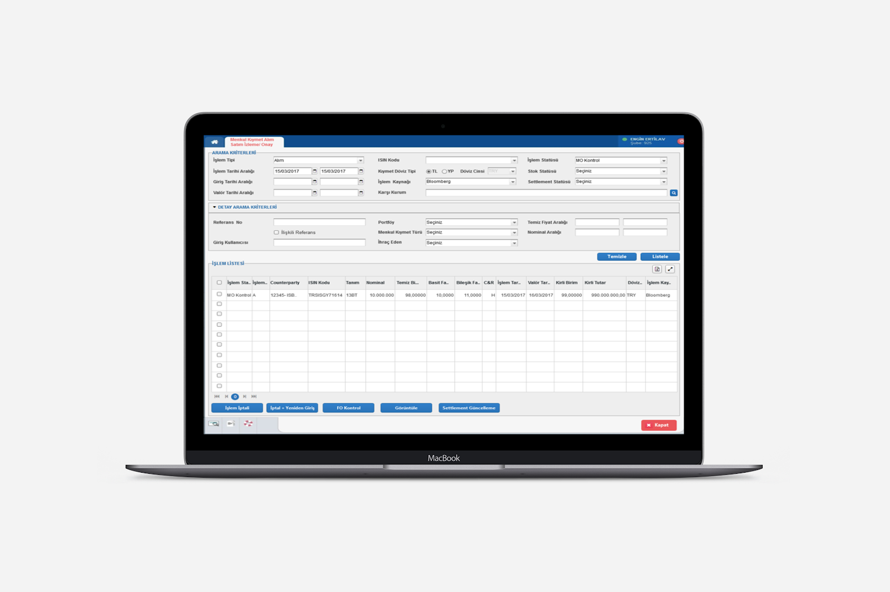
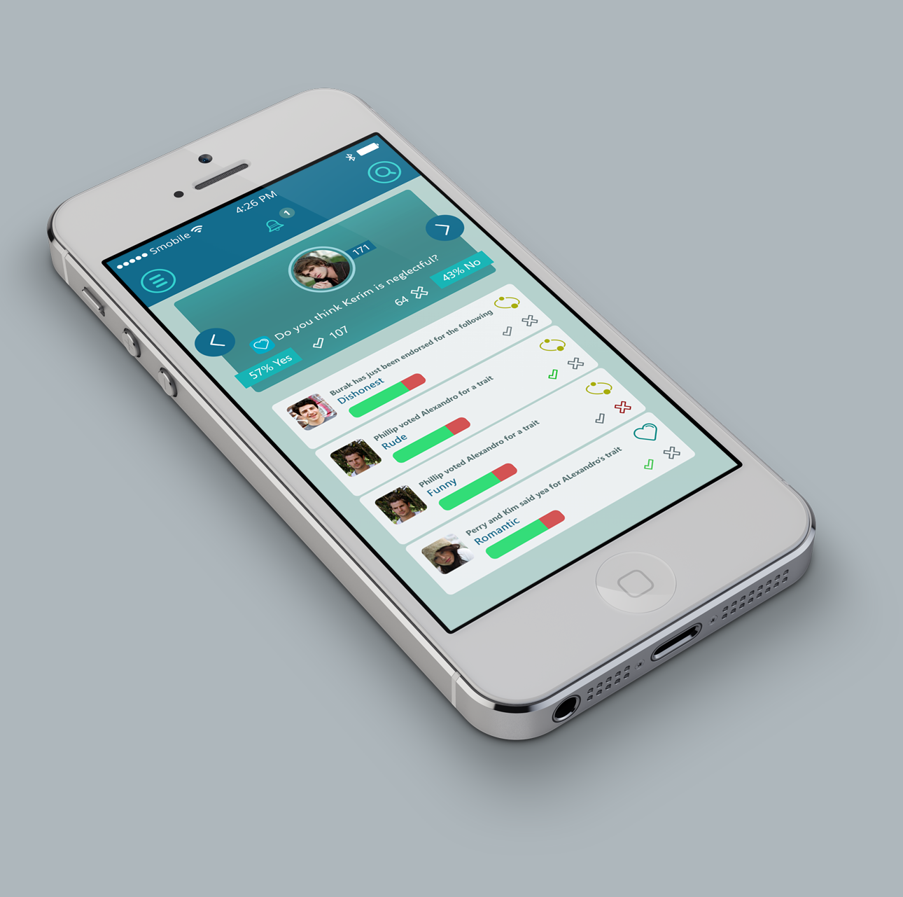

Here is a list of my projects

## Boxlin: 3D Home Designer

*2017 - 2018 | Side Project*

**Tech Stack**: *TypeScript, JavaScript, Angular 7, PWA, Service Workers, Express, MongoDB*

Boxlin helps users to draw their own houses in 3D and decorate their interiors with 3D furniture models. The application is available at: http://www.boxlin.com . The project is built as a Progressive Web Application ( PWA ), meaning that it is accessible on web but acts as a fullscreen mobile application on mobile. The project is built with Angular 7.

[Try Here](http://www.boxlin.com/)

## STSI Holding Offer Management Application

*2019 Jan - 2019 May | SDSI Company - Lugano, Switzerland - http://stsiholding.com/*

**Tech Stack**: *JavaScript, ReactJS, MongoDB, Redux, SendGrid, Draft.JS*

STSI Holding is an international first-quality and secondary steel trading company based in Switzerland. Their web application allows them to manage email campaigns, create smart offers which take client’s location, transporting costs and material quality preferences. The project is still getting developed for extra features.

## Anaokulum (My Kindergarten)

*2019 Jan - 2019 March | Side Project*

**Tech Stack**: *JavaScript, React Native, Cross Platform Mobile, Firebase Firestore DB, Redux*

Anaokulum is designed for parents and kindergarten teachers to easily communicate with each other. Parents can track the daily activities of their children whereas teachers can easily make announcements using templates. They can share photos and launch chat sessions. The project has a chat mechanism using cloud functions and realtime database. The application is built as a cross platform application with React Native, meaning that the same code produces both iOS and Android applications natively, which reduces development costs drastically.

[App Store Link](https://play.google.com/store/apps/details?id=com.anaokulum_fe)

## Contract Based Banking Software

*2017 - 2018 | [Yapi Kredi Bank](https://www.yapikredi.com.tr/), Istanbul*

**Tech Stack**: *JavaScript, HTML5, KendoUI, J2EE, Spring, Hibernate, Oracle RDBMS*

A contract-based project built for Yapi Kredi Treasury Department. The application helps back-office, middle-office and front-office staff to set price, rediscount, create portfolios, define counterparties for inter-bank trading of fixed income securities such as bonds.

## WhoWho

*2014 | Side Project*

**Tech Stack**: *Objective-C, Java, XCode, Android Studio, Spring MVC, Hibernate*

The application uses Facebook Graph API to fetch Facebook friend list and then lets users to tag friends with character attributes. The application is developed for both iOS and Android natively.

