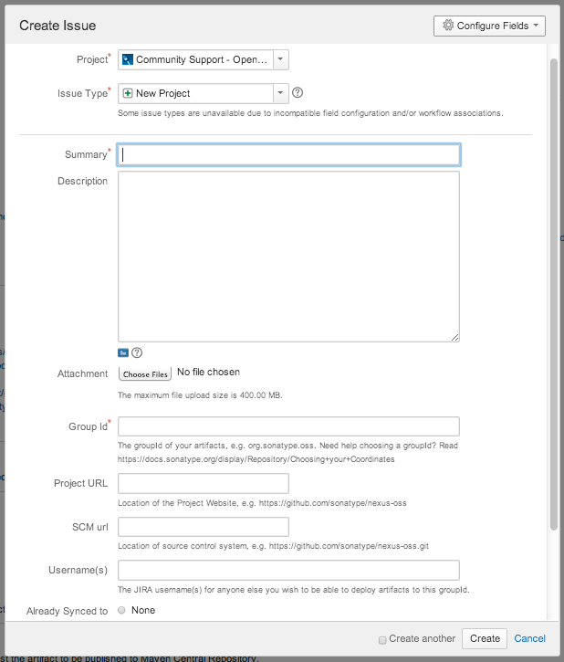

Bu dökümanda Maven ile yapılandırımış açık kaynaklı bir projenin Maven Central Repository'ye atılabilmesi için gerekli adımlar anlatılmıştır.


> **Maven Nedir?**
> 
> Maven konfigurasyon dosyaları ile kullanmak istediğiniz kütüphaneleri belirtirsiniz , Maven sizin için bu kütüphaneleri indirir ve projenizi derler. Maven proje döngüsünü kolaylaştırmak için bir sürü özelliğe sahiptir . 
> 
> 
>
> Temel Maven Bilgileri için güzel bir Türkçe kaynak:
> 
> http://serkansakinmaz.blogspot.com.tr/2013/01/apache-maven.html

> **Maven Central Repository Nedir?**
> 
> Maven Central Repository: Basit bir dependency tag'ı ile ya da bir archetype:generate komutuyla projenizin dünya üzerindeki tüm Maven projeleri tarafından erişilmesini ve kaynak kodlarına ulaşılmasını sağlar.

Sonatype OSSRH (OSS Repository Hosting Service), açık kaynaklı projeler için hosting hizmeti sağlamakta, bunun için Nexus Repository sistemini kullanmaktadır. Projeler https://oss.sonatype.org/ adresinden erişilebilmektedir.

Bu sayede proje geliştiricileri;

 - Snapshot deploy edebilir,
 - Release Staging (Versiyonlama) yapabilir,
 - Release'leri Promote edebilir, yani Maven Central Repository'den dependency olarak indirilebilir hale getirebilirler.
 
 Yapılması gerekenler özetle;
 
 - Sonatype JIRA Hesabı açmak,
 - JIRA Talebi için Issue oluşturmak
 - POM Konfigürasyonlarını düzenlemek.
 - Artifact'leri GPG aracıyla imzalamak.
 - JIRA Talebine yorum ekleyerek Maven Central Repo aktarımını istemektir.

 Bu dökümanda yukarıda belirtilen adımlar açıklanmaktadır.

### Adım adım yönlendirme

> Ön Gereksinimler
> 
>  - JDK 5 Ve üzeri
>  - GNU Privacy Guard (GPG) Uygulaması)
>  - Maven 2.2.1 ve üzeri
>  - Sisteminizde kurulu olmalıdır. 
> 
> GPG İçin: http://www.gnupg.org/download/index.html

Aşağıdaki adımlar izlenir:

#### 1 - Projenin Bir SCM üzerinde tutulması

Github ya da BitBucket benzeri, Internet üzerinden erişilebilir bir Versiyon Kontrol Sistemine (Software Configuration Management - SCM) projenizin kodlarını yükleyin.

#### 2 - JIRA Ticket oluşturulması

https://issues.sonatype.org/'a kaydolunur ve bir ticket oluşturulur: 



JIRA Task'ı çok kısa bir sürede işleme alınacak ve OSS Sunucularında projeye özgü Staging Repository'ler oluşturulacak, konu ile ilgili mail elinize ulaşacaktır. Örnek bir cevap aşağıdaki gibi olacaktır:

> ```
> Devin Mayhew added a comment - 04/06/14 09:22 PM
> Configuration has been prepared, now you can:
> 
> Deploy snapshot artifacts into repository https://oss.sonatype.org/content/repositories/snapshots
> Deploy release artifacts into the staging repository https://oss.sonatype.org/service/local/staging/deploy/maven2
> Promote staged artifacts into repository 'Releases'
> Download snapshot and release artifacts from group https://oss.sonatype.org/content/groups/public
> Download snapshot, release and staged artifacts from staging group https://oss.sonatype.org/content/groups/staging
> 
> please comment on this ticket when you promoted your first release, thanks
> ```

#### 3- POM Düzenlemesi

İlgili Maven Artifact'lerinin POM'larını aşağıdaki zorunlu alanları içerecek şekilde düzenleyin:

```xml
<modelVersion>
<groupId>
<artifactId>
<version>
<packaging>
<name>
<description>
<url>
<licenses>
<scm><url>
<scm><connection>
<developers>
```

Parent tagını aşaiıdaki gibi ekleyin:

```xml
<project>
  ...
  <parent>
    <groupId>org.sonatype.oss</groupId>
    <artifactId>oss-parent</artifactId>
    <version>7</version>
  </parent>
  ...
</project>
```

SCM (Git için örnek verilmiştir) Bilgilerini aşağıdaki gibi ekleyin:

```xml
<project>
  ...
  <scm>
    <connection>scm:git:git@github.com:juven/git-demo.git</connection>
    <developerConnection>scm:git:git@github.com:juven/git-demo.git</developerConnection>
    <url>git@github.com:juven/git-demo.git</url>
  </scm>
  ...
</project>
```

Lokal geliştirme ortamınızda bulunan Maven Settings.xml dosyanızı aşağıdaki gibi Sonatype JIRA bilgileriyle güncelleyin:

> UNIX Ortamlarında standart olarak ~/.m2 alanında bulunur.
> 
> Windows Ortamında ise $MAVEN_HOME/conf altında yer alır.


```xml
<settings>
  ...
  <servers>
    <server>
      <id>sonatype-nexus-snapshots</id>
      <username>your-jira-id</username>
      <password>your-jira-pwd</password>
    </server>
    <server>
      <id>sonatype-nexus-staging</id>
      <username>your-jira-id</username>
      <password>your-jira-pwd</password>
    </server>
  </servers>
  ...
</settings>
```

[Bir sonraki yazıda](/acik-kaynakli-projelerin-maven-central-repository-uzerinden-yayinlanmasi-22/) imzalama ve yayınlama adımlarını göreceğiz.
