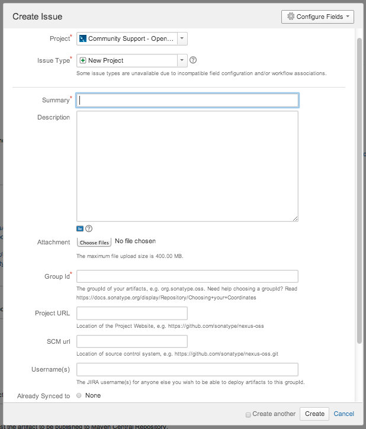

[Bir önceki yazıda](/acik-kaynakli-projelerin-maven-central-repository-uzerinden-yayinlanmasi-12/) projenin bir SCM'de oluşturulması ve Sonatype JIRA'a kayıt oluşturma adımlarını inceledik.

Bu yazıda paket imzalama ve Maven Central Repository'de proje yayınlama adımlarını göreceğiz.


> **Maven Nedir?**
> 
> Maven konfigurasyon dosyaları ile kullanmak istediğiniz kütüphaneleri belirtirsiniz , Maven sizin için bu kütüphaneleri indirir ve projenizi derler. Maven proje döngüsünü kolaylaştırmak için bir sürü özelliğe sahiptir . 
> 
> 
>
> Temel Maven Bilgileri için güzel bir Türkçe kaynak:
> 
> http://serkansakinmaz.blogspot.com.tr/2013/01/apache-maven.html

> **Maven Central Repository Nedir?**
> 
> Maven Central Repository: Basit bir dependency tag'ı ile ya da bir archetype:generate komutuyla projenizin dünya üzerindeki tüm Maven projeleri tarafından erişilmesini ve kaynak kodlarına ulaşılmasını sağlar.

Sonatype OSSRH (OSS Repository Hosting Service), açık kaynaklı projeler için hosting hizmeti sağlamakta, bunun için Nexus Repository sistemini kullanmaktadır. Projeler https://oss.sonatype.org/ adresinden erişilebilmektedir.

Bu sayede proje geliştiricileri;

 - Snapshot deploy edebilir,
 - Release Staging (Versiyonlama) yapabilir,
 - Release'leri Promote edebilir, yani Maven Central Repository'den dependency olarak indirilebilir hale getirebilirler.
 
 Yapılması gerekenler özetle;
 
 - Sonatype JIRA Hesabı açmak,
 - JIRA Talebi için Issue oluşturmak
 - POM Konfigürasyonlarını düzenlemek.
 - Artifact'leri GPG aracıyla imzalamak.
 - JIRA Talebine yorum ekleyerek Maven Central Repo aktarımını istemektir.

 Bu dökümanda yukarıda belirtilen adımlar açıklanmaktadır.

### Adım adım yönlendirme

> Ön Gereksinimler
> 
>  - JDK 5 Ve üzeri
>  - GNU Privacy Guard (GPG) Uygulaması)
>  - Maven 2.2.1 ve üzeri
>  - Sisteminizde kurulu olmalıdır. 
> 
> GPG İçin: http://www.gnupg.org/download/index.html

Aşağıdaki adımlar izlenir:

#### 1 - Projenin Bir SCM üzerinde tutulması:

Github ya da BitBucket benzeri, Internet üzerinden erişilebilir bir Versiyon Kontrol Sistemine (Software Configuration Management - SCM) projenizin kodlarını yükleyin.

#### 2 - JIRA Ticket oluşturulması

https://issues.sonatype.org/'a kaydolunur ve bir ticket oluşturulur: 



JIRA Task'ı çok kısa bir sürede işleme alınacak ve OSS Sunucularında projeye özgü Staging Repository'ler oluşturulacak, konu ile ilgili mail elinize ulaşacaktır. Örnek bir cevap aşağıdaki gibi olacaktır:

> ```
> Devin Mayhew added a comment - 04/06/14 09:22 PM
> Configuration has been prepared, now you can:
> 
> Deploy snapshot artifacts into repository https://oss.sonatype.org/content/repositories/snapshots
> Deploy release artifacts into the staging repository https://oss.sonatype.org/service/local/staging/deploy/maven2
> Promote staged artifacts into repository 'Releases'
> Download snapshot and release artifacts from group https://oss.sonatype.org/content/groups/public
> Download snapshot, release and staged artifacts from staging group https://oss.sonatype.org/content/groups/staging
> 
> please comment on this ticket when you promoted your first release, thanks
> ```

#### 3- POM Düzenlemesi

İlgili Maven Artifact'lerinin POM'larını aşağıdaki zorunlu alanları içerecek şekilde düzenleyin:

```xml
<modelVersion>
<groupId>
<artifactId>
<version>
<packaging>
<name>
<description>
<url>
<licenses>
<scm><url>
<scm><connection>
<developers>
```

Parent tagını aşaiıdaki gibi ekleyin:

```xml
<project>
  ...
  <parent>
    <groupId>org.sonatype.oss</groupId>
    <artifactId>oss-parent</artifactId>
    <version>7</version>
  </parent>
  ...
</project>
```

SCM (Git için örnek verilmiştir) Bilgilerini aşağıdaki gibi ekleyin:

```xml
<project>
  ...
  <scm>
    <connection>scm:git:git@github.com:juven/git-demo.git</connection>
    <developerConnection>scm:git:git@github.com:juven/git-demo.git</developerConnection>
    <url>git@github.com:juven/git-demo.git</url>
  </scm>
  ...
</project>
```

Lokal geliştirme ortamınızda bulunan Maven Settings.xml dosyanızı aşağıdaki gibi Sonatype JIRA bilgileriyle güncelleyin:

> UNIX Ortamlarında standart olarak ~/.m2 alanında bulunur.
> 
> Windows Ortamında ise $MAVEN_HOME/conf altında yer alır.


```xml
<settings>
  ...
  <servers>
    <server>
      <id>sonatype-nexus-snapshots</id>
      <username>your-jira-id</username>
      <password>your-jira-pwd</password>
    </server>
    <server>
      <id>sonatype-nexus-staging</id>
      <username>your-jira-id</username>
      <password>your-jira-pwd</password>
    </server>
  </servers>
  ...
</settings>
```

#### 4 - Artifact'lerin imzalanması:

Öncelikle pom.xml dosyasının yer aldığı proje dizinine gidilir:

```sh
Omers-iMac:target omerg$ cd <projectPath>
```

İmzalanacak Jar'ların oluşması için proje Install edilir:

```sh
Omers-iMac:target omerg$ mvn clean install
```

Oluşan jar dosyası imzalanmadan önce imzalama işlemini yapacak kullanıcı için anahtar oluştturulur:

```sh
Omers-iMac:target omerg$  gpg --gen-key
```

Anahtarın doğru oluşturulduğu kontrol edilir. Aşağıdaki komutun ardından bir liste görüntülenmesi gerekir:

```sh
Omers-iMac:target omerg$ gpg --list-keys
 
 
/Users/omerg/.gnupg/pubring.gpg
-------------------------------
pub   2048D/00D026C4 2010-08-19 [expires: 2015-08-18]
uid                  GPGTools Team <team@gpgtools.org>
uid                  GPGMail Project Team (Official OpenPGP Key) <gpgmail-devel@lists.gpgmail.org>
uid                  GPGTools Project Team (Official OpenPGP Key) <gpgtools-org@lists.gpgtools.org>
uid                  [jpeg image of size 5871]
sub   2048g/DBCBE671 2010-08-19 [expires: 2015-08-18]
 
pub   2048R/7DE817E8 2014-04-13 [expires: 2018-04-13]
uid                  Omer Gurarslan <omerg@lucidcode.com.tr>
sub   2048R/96C4DFD1 2014-04-13 [expires: 2018-04-13]
 
Omers-iMac:target omerg$
```

> gpg --gen-key adımının bir defa yapılması yeterlidir.

Oluşan Jar'ların dizini olan target a gidilir:

```sh
Omers-iMac:target omerg$ cd target
```

İmzalanacak Jar seçilir ve imzalanır:

```sh
Omers-iMac:target omerg$ gpg -ab kite-archetype-1.0.9.jar
```

İmzalama işleminin başarılı olup olmadığını kontrol edin:

```sh
gpg --verify
```

İmzanın başka kişiler tarafından karşılaştırılıp doğrulanabilmesi için bir imza sunucusuna aktarın:

```sh
$ gpg --keyserver hkp://pool.sks-keyservers.net --send-keys C6EED57A
```

#### 5 -SNAPSHOT'ların publish edilmesi:

> İkinci adımdaki JIRA Issue'su cevaplandıktan ve konfigürasyonun tamamlandığına dair maili aldıktan sonra aşağıdaki adımlara geçebilirsiniz.

Aşağıdaki komut ile SNAPSHOT versiyonlu JAR dosyası OSS Repository'sine aktarılmış olur:

```sh
mvn clean deploy
```

#### 6 - Versiyonlanmış JAR'ların publish edilmesi (Staging)

```sh
$ mvn release:clean
$ mvn release:prepare
$ mvn release:perform
```

Bu adımlarda hata alıyorsanız komutları bir kez daha, -X argumanı ile çalıştırın ve logları inceleyin. Olası hata alma nedenleri:

 - İmzalama işlemi başarızız olmuş, .asc dosyaları oluşmamıştır.
 - SCM Versiyon Kontrol Sisteminde dosyalar bulunamamıştır ya da varsayılan Working Directory'de pom xml bulunamamıştır. pom.xml in SCM'dse kök dizinde olmasına özen gösterin.
 - İlgili pom.xml dosyasındaki versiyon tagında -SNAPSHOT son eki bulunmamaktadır.

#### 7 - Staging işleminin OSS Sonatype üzerinde tamamlanması

 - https://oss.sonatype.org/ sayfasına kullanıcı adınız ve şifrenizle giriş yapın.
 - Soldaki navigasyon panelinden "Staging Repositories" alanını seçin.
 - Ana ekrana gelen listede, yarattığınız artifact'e ait groupId'yi içeren satırı bulun.
 - Projenizi seçtiğinizde üst satırda "Close" buton aktifleşecektir. Bu butona bastığınızda POM dosyası ve asc dosyaları kontrol edilir.
 - İşlemin başarısız olması durumunda "Activity" tabında hata nedenini görebiliyor olacaksınız.

İşlemin başarılı olması durumunda "Release" butonuna basarak Release işlemini tamamlamış olacaksınız.

> **Önemli Not:**
> 
> İlk defa oluşturulan Release'ler için, daha önce açmış olduğunus JIRA task'ına geri dönüp bir comment yazmanız gerekiyor. Aşağıdaki şekilde olabilir:
> 
> *"The first release has been promoted. We kindly request that the artifact to be published to Maven Central Repository."*

### Sonuç

1 - 2 Saatlik süre içerisinde ilgili Maven Artifact, Maven Central Repository'de görülebilir hale gelecektir.

Bu sayede projeniz global olarak tüm Maven projeleri tarafından erişilebilir hale gelecektir.

### İlgili Dökümanlar

 - https://docs.sonatype.org/display/Repository/Sonatype+OSS+Maven+Repository+Usage+Guide
 - http://jroller.com/holy/entry/releasing_a_project_to_maven
 - http://central.sonatype.org/pages/releasing-the-deployment.html
 - https://docs.sonatype.org/display/Repository/How+To+Generate+PGP+Signatures+With+Maven
