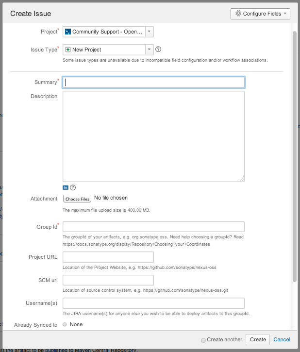

In this document, we explore the steps for taking an open-source project and getting ready for deploying into Maven Central Repository.


> **What is Maven?**
> 
> With Maven configuration files you specify the libraries you want to use, Maven downloads these libraries for you and compiles your project. Maven has a lot of features to facilitate the project cycle. 
> 
> 
>
> A beautiful resource for a basic introduction to Maven:
> 
> https://maven.apache.org/what-is-maven.html

> **What is Maven Central Repository?**
> 
> With a simple POM.xml configuration and a few maven commands, your project can be shared on Maven Central Repository and can be consumed by all Maven projects around the world.

Sonatype OSSRH (OSS Repository Hosting Service) provides hosting services for open source projects and uses the Nexus Repository system. Projects can be accessed at https://oss.sonatype.org/.

In this way, project developers can;

 - Deploy snapshots,
 - Release staging versions,
 - Promote their releases, i.e. expose their projects on Maven Central Repository other projects can download and connect with a dependency tie.
 
 The required steps to share the project on Maven Central Repository are as follows:
 
 - Open a Sonatype JIRA Account,
 - Create a JIRA Issue for Access Request
 - Edit POM Configurations.
 - Sign artifacts with the GPG tool.
 - Requesting the Maven Central Repo transfer by adding some comments to the JIRA request.

Lets take a closer look to the above mentioned steps.

### Steps to share a project

> Prerequisites
> 
> - JDK 5 and above
> - GNU Privacy Guard (GPG) Application
> - Maven 2.2.1 and above
>
> Must be installed on your system
> 
> Link for downloading GPG: http://www.gnupg.org/download/index.html

Simply follow the steps to share a project on Maven Central Repo!

#### 1 - Maintaining the project on an SCM

Upload your project code to an Online Version Control System (VCS), such as Github, GitLab or BitBucket.

#### 2 - Create a JIRA Ticket

Sign-up to https://issues.sonatype.org/'a and create an issue ticket as seen below: 



The JIRA Task will be processed in a very short time and the project-specific Staging Repository will be created on the OSS Servers. An example answer would be as follows:

> ```
> Devin Mayhew added a comment - 04/06/14 09:22 PM
> Configuration has been prepared, now you can:
> 
> Deploy snapshot artifacts into repository https://oss.sonatype.org/content/repositories/snapshots
> Deploy release artifacts into the staging repository https://oss.sonatype.org/service/local/staging/deploy/maven2
> Promote staged artifacts into repository 'Releases'
> Download snapshot and release artifacts from group https://oss.sonatype.org/content/groups/public
> Download snapshot, release and staged artifacts from staging group https://oss.sonatype.org/content/groups/staging
> 
> please comment on this ticket when you promoted your first release, thanks
> ```

#### 3- POM Configuration

Arrange the Project Object Model (POM) file of the relevant Maven Artifacts to include the following required fields:

```xml
<modelVersion>
<groupId>
<artifactId>
<version>
<packaging>
<name>
<description>
<url>
<licenses>
<scm><url>
<scm><connection>
<developers>
```

Add the Parent tag as follows:

```xml
<project>
  ...
  <parent>
    <groupId>org.sonatype.oss</groupId>
    <artifactId>oss-parent</artifactId>
    <version>7</version>
  </parent>
  ...
</project>
```


Add SCM information (Provided example is for Git) as follows:

```xml
<project>
  ...
  <scm>
    <connection>scm:git:git@github.com:juven/git-demo.git</connection>
    <developerConnection>scm:git:git@github.com:juven/git-demo.git</developerConnection>
    <url>git@github.com:juven/git-demo.git</url>
  </scm>
  ...
</project>
```

Update your Maven Settings.xml file in your local development environment with Sonatype JIRA information as follows:

> In the UNIX Environment, it is located in the ~ / .m2 area as a standard.
> 
> In Windows Environment, it is located under $ MAVEN_HOME / conf.

```xml
<settings>
  ...
  <servers>
    <server>
      <id>sonatype-nexus-snapshots</id>
      <username>your-jira-id</username>
      <password>your-jira-pwd</password>
    </server>
    <server>
      <id>sonatype-nexus-staging</id>
      <username>your-jira-id</username>
      <password>your-jira-pwd</password>
    </server>
  </servers>
  ...
</settings>
```

[In the following post,](/publishing-open-source-projects-on-maven-central-repository-22/) we will see the signing and publishing steps.
