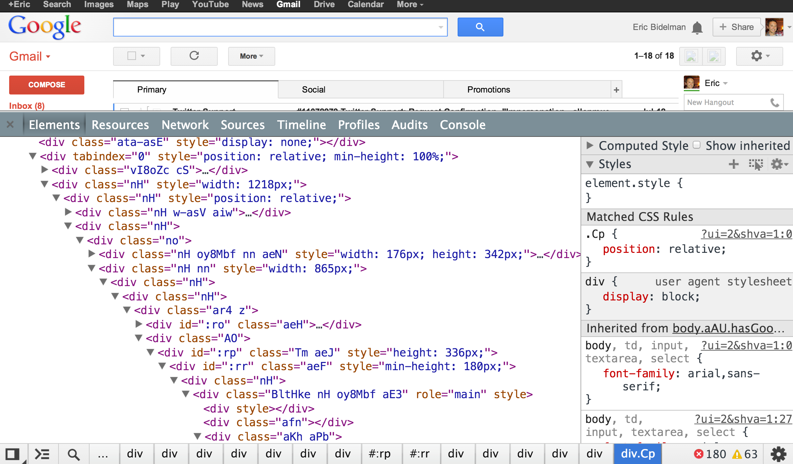

"Welcome to the Future."

The first sentence on the Web site of Polymer Project, which is still in progress by Google, shows the ambition of the project, and it gives the clue about the most important motivation of the project: Promoting the Web Components Model published by the World Wide Web Consortium (W3C). (If you say who writes them in the W3C, Google employees :blush: )


> Exquisite logo. It is similar to the molecular representation of the polymer, which means the combination of more than one monomer component. At the same time, it contains the < / > characters in HTML tags.

In this document I will try to explain how Polymer was born and what kind of problems it aims to solve. After that, I will examine the four compartments of the Web Components model, which is the main reason of Polymer's existence and which constitutes the skeleton of Polymer library.

In summary we will talk about:

- [Defining the Problem](#defining-the-problem)
- [Polymer](#polymer)
  - [Component Usage](#component-usage)
  - [New Component Definition](#new-component-definition)

<a name="defining-the-problem"></a>
### Defining the Problem

As modern web applications are getting more enriched in content, the need for tools to develop these applications is similarly increasing. Developers have to face the extra complexity brought by CSS preprocessors (such as less-sass-stylus), JavaScript-based template engines (such as Knockout.js, Angular.js, mustache.js), rich component libraries (Kendu UI, Ext.js), jQuery, test tools, etc. Eventually, the applications end up with endless tag attributes and a large amount of CSS and JavaScript placed between them.

The following HTML view shows some of the HTML content in the Gmail page; an image to better tell what I mean:




> Is this how we code even today?!

Many of the libraries and technology that I've mentioned and many more, let us do modern web applications; but these libraries need to be selected, encapsulated in a more compact way to the application development layer, and therefore HTML should maintain its readability aspect.

<a name="polymer"></a>
### Polymer

Let's take a look at the following usage example for Polymer before examining the fancy naming as "Declarative, Encapsulated programming with Reusable Components". We will see that is extremely easy to use any Polymer component in a web application:

<a name="component-usage"></a>
##### Component Usage

 - The component is imported: The component we get from the web is added to the page by the HTML Import method (<link rel = "import")
 - The component is used: Once imported, the components are now available as any HTML tag.

```html
<!-- Polyfill Web Bilesenleri sayesinde eski tarayıcılar desteklenir -->
<script src="components/platform/platform.js"></script>
 
<!-- Bilesen aktarilir -->
<link rel="import" href="google-map.html">
 
<!-- Bilesen kullanilir -->
<google-map lat="37.790" long="-122.390"></google-map>
```

<a name="new-component-definition"></a>
##### New Component Definition

Polymer also supports Web Components technologies with a range of syntactic sugars, making it easy to identify new components:

```html
/* Custom element tanımları  polymer-element tag'ları içrisinden yapılıyor. */
<polymer-element name="my-counter" attributes="counter">
 
  <template>
    <style> /*...*/ </style>
    <div id="label"><content></content></div>
    Value: <span id="counterVal">{{counter}}</span><br>
    <button on-tap="{{increment}}">Increment</button>
  </template>
   
  <script>
    Polymer({
      counter: 0, // Default value
      counterChanged()this.$.counterVal.classList.add('highlight');
      },
      increment: function() {
        this.counter++;
      }
    });
  </script>
</polymer-element>
```

The Polymer component described above can be used as follows:

```html
<my-counter counter="10">Points</my-counter>
```

Rather than telling the Polymer project alone, it would be better to bring the subject to the Web Components model. In fact, the concepts of Polymer and Web Components are already intertwined. To better understand this, let's see exactly what the polymer consists of:

The Polymer Project consists of the following 3 parts:

 <a name="yeni-bilesen-tanimi"></a>
 
 - Component Library: Ready for use in web applications Visual component libraries and a set of useful tools.
 - Application Architecture: A Modern Web Application Architecture Implementing 4 New W3C Technologies ( We will talk about each of them in detail)
 - Polymer Polyfills: A library that harmonizes scanners that do not yet recognize Web Components features as if they were available.

Let's examine these components in the [following post](/polymer-project-and-web-components-22).
