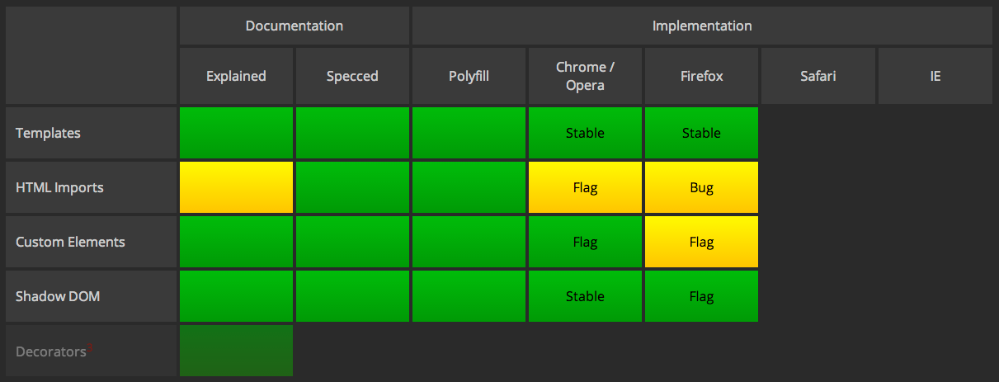

[In the previous post](/polymer-project-and-web-components-12), we made a nice introduction to Polymer and Web Components. In this post, we will go into a bit more detail:

- [Component Library](#component-library)
- [Web Components](#web-components)
  - [Templates](#templates)
  - [Custom Elements](#custom-elements)
  - [Shadow DOM](#shadow-dom)
  - [Imports](#imports)
- [Polymer Polyfills](#polymer-polyfills)
- [Further Reading](#further-reading)

The Polymer Project consists of the following 3 parts:


 - Component Library: Ready for use in web applications Visual component libraries and a set of useful tools.
 - Application Architecture: A Modern Web Application Architecture Implementing 4 New W3C Technologies
 - Polymer Polyfills: A library that adapts browsers that do not yet recognize Web Components so that the features work seamlessly.

<a name="component-library"></a>
### Component Library

To see what exactly you can do with Polymer and Web Components technology, you can take a look at these 3 very eye-catching demo applications by Google:

[Topeka](https://github.com/googlearchive/topeka)

A quiz application that uses the basic visual components presented in the paper elements project.


[Calculator](https://github.com/googlearchive/paper-calculator/blob/master/demo.html)

Sample calculator application with the effect of visual effect called ink effect.

[Paper Elements](https://www.webcomponents.org/collection/polymerelements/paper-elements)

Demo application that exemplifies the concept of Material Design together with Polymer components.

> You'll be able to view near-perfect applications on Chrome 32 and above. For best results, however, Chrome Canary is recommended:
>  
> http://www.google.com/intl/en/chrome/browser/canary.html

<a name="web-components"></a>
### Web Components

The Web Components component model consists of the following 4 parts:

<a name="templates"></a>
##### 1- Templates

Although the HTML code contained in the `<template>` HTML tags is contained in the document, it is not activated unless the it is consumed by template engine (Parsing will not occur).

```html
<template id="commentTemplate">
    <div>
        
        <div class="comment-text"></div>
    </div>
</template>
```

<a name="custom-elements"></a>
##### 2- Custom Elements

It enables developers to define any desired HTML tag and use them as a regular HTML tag in the code.

```js
var p = Object.create(HTMLButtonElement.prototype);
var FancyButton = document.registerElement('fancy-button',
                                           {extends: 'button', prototype: p});

```

```html
<fancy-button>Click Me</fancy-button>
```
<a name="shadow-dom"></a>
##### 3- Shadow DOM

The inner text content inside a HTML tag is rendered, but that inner text inside is not contained in the DOM tree, but rather in a separate context called Shadow DOM. In this way, the shadow DOM lets you place the children in a scoped subtree, so document-level CSS can't restyle the button by accident.

```html
<button>Hello, world!</button>
<script>
var host = document.querySelector('button');
var root = host.createShadowRoot();
root.textContent = 'こんにちは、影の世界!';
</script>
```

> Instead of printing "Hello World", the above code will print 'こんにちは、影の世界!' !

<a name="imports"></a>
##### 4- Imports

It allows you to transfer HTML content files to the content of the page, such as transferring CSS and JavaScript content dynamically from different channels in standard HTML. Although it is for the same purpose as iframe, it is an innovative solution in terms of performance, and to solve the style problems that are specific to the iframe.

```html
<link rel="import" href="google-map.html">
```

> For more information about the Web Components Model, I suggest you to review the W3C documentation:
>  
>  http://w3c.github.io/webcomponents/explainer/

<a name="polymer-polyfills"></a>
#### Polymer Polyfills

> What is a Polyfill?
>
>  It is downloadable code packets, which aim to provide features that a browser does not support.

The various Polyfills included in the Polymer library serve to provide these features in browsers that do not yet support Web Components technology. Over time, with the introduction of Web Components technologies, Polymer will complete the task as a library and will be able to get the Web Components model into the Web world.

As of July 2014, common Internet browsers are implementing Web Components standards as follows:



For the current table: http://jonrimmer.github.io/are-we-componentized-yet/

<a name="further-reading"></a>
#### Further Reading

- http://webcomponents.org/
- http://html5-demos.appspot.com/static/cds2013/index.html#4
- http://w3c.github.io/webcomponents/explainer/
- https://www.google.com/events/io/schedule/session/de22e147-07b6-e311-8491-00155d5066d7
- http://code.tutsplus.com/tutorials/using-polymer-to-create-web-components--cms-20475
- http://robdodson.me/webcomponents-revolution/#/
- http://html5-demos.appspot.com/static/polymer/index.html#1
- http://w3c.github.io/webcomponents/explainer/#template-section
- http://tamas.io/x-flickr-custom-polymer-element/
