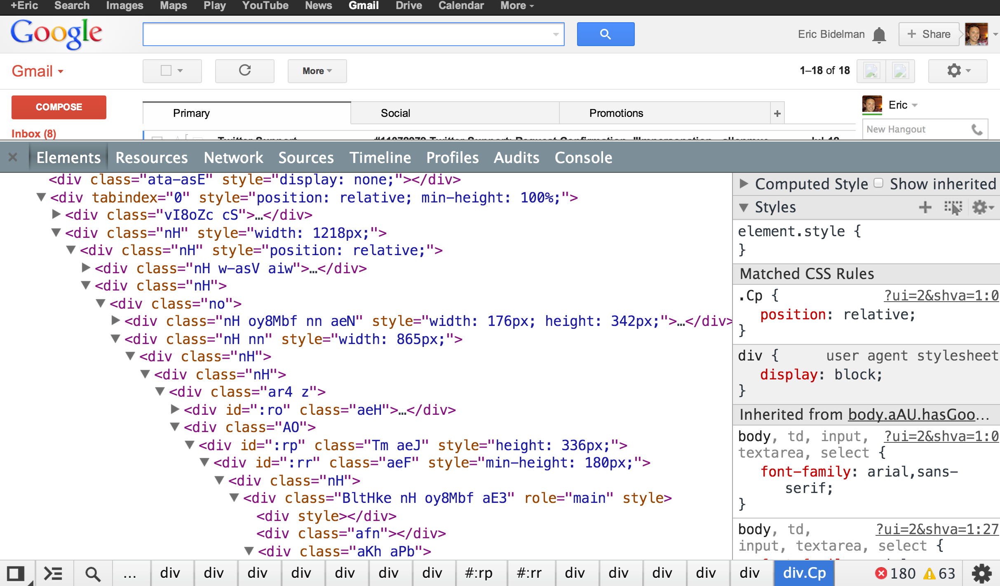

# Polymer Project ve Web Components

"Geleceğe Hoşgeldiniz."

Google tarafından çalışmaları devam eden Polymer Projesi'nin Web Sayfasındaki ilk cümle, projenin iddialı oluşuyla birlikte aslında projenin en temel motivasyonunu bize anltıyor: World Wide Web Consortium (W3C) tarafından taslak olarak yayınlanan Web Components Modeli'ni uygulamak ve yaygınlaştırmak. (W3C'de bunları kim yazıyor derseniz, yine Google çalışanları :blush: )


>Nefis bir logo. İçeriğinde HTML taglarında yer alan < / > karakterlerini barındırırken aynı zamanda monomer isimli birden fazla bileşenin birleşimi anlamına gelen (Projenin ana fikrini de yansıtan bir tanım) polimer'in molekülel gösterimine benzetilmiş.

Bu dökümanda Polymer'in nasıl bir dünyaya doğduğunu, ne gibi problemleri çözeceğini anlatmaya çalışacağım. Sonrasında Polymer'in varoluş nedeni olan ve vaadettiği tüm güzelliklerin / kolaylıkların esas sağlayıcısı olan Web Components modelini, bu modeli oluşturan 4 temel W3C standardını irdeleyeceğim.

Aşağıda listelenmiş olan kısayollar size bunu sağlayacaktır:

- [Problemi tanımlayalım](#problemi-tanimlayalim)
- [Polymer](#polymer)
  - [Bileşen Kullanımı](#bilesen-kullanimi)
  - [Yeni Bileşen Tanımı](#yeni-bilesen-tanimi)

<a name="problemi-tanimlayalim"></a>
### Problemi Tanımlayalım

Modern web uygulamaları içerik açısından zenginleşirken bu uygulamaları geliştirebilmek için ihtiyaç duyulan araçlar git gide artıyor. CSS önişlemcileri (less - sass - stylus gibi), JavaScript tabanlı taslaklayıcılar (Knockout.js, Angular.js, mustache.js gibi), zengin bileşen kütüphaneleri (Kendu UI, Ext.js), jQuery, test araçları derken HTML okunaklı bir işaretleme dili olmaktan çıkıp bir biri içinde yığılmış HTML tagları, sonsuz tag attribute leri ve aralarına yerleştirilmiş bol miktarda CSS ve JavaScript olarak karşımıza çıkıyor.

Aşağıdaki HTML görünümü, Gmail sayfası HTML içeriğininin bir kısmını gösteriyor; ne demek istediğimi daha iyi anlatacak bir görüntü:




> Günümüzde hala böyle mi kodluyoruz?!

Saydığım ve aklıma gelmeyen onca kütüphane ve teknoloji, modern web uygulamalarını yapmamızı sağlıyor, ancak bu kütüphanelerin seçilmesi, uygulama geliştirme katmanına daha derli toplu bir biçimde sunulacak şekilde kapsüllenmesi ve bu sayede HTML'in sade konumunu koruması gerekiyor.

<a name="polymer"></a>
### Polymer

Polymer için "Declarative, Encapsulated programming with Reusable Components" şeklinde bir manşet atmadan önce aşağıdaki kullanım örneğine bir göz atalım. Polymer'de de herhangi bir bileşeni sayfada kullanmak son derece kolay:

<a name="bilesen-kullanimi"></a>
##### Bileşen Kullanımı

Bileşen aktarılır: Web'den edindiğimiz bileşeni sayfaya HTML Import yöntemi ile eklenir (<link rel="import")
Bileşen kullanılır: Bir kere import edildikten sonra bileşenler artık herhangi bir HTML tag'ı gibi kullanıma açıktırlar.

```html
<!-- Polyfill Web Bilesenleri sayesinde eski tarayıcılar desteklenir -->
<script src="components/platform/platform.js"></script>
 
<!-- Bilesen aktarilir -->
<link rel="import" href="google-map.html">
 
<!-- Bilesen kullanilir -->
<google-map lat="37.790" long="-122.390"></google-map>
```

<a name="yeni-bilesen-tanimi"></a>
##### Yeni Bileşen Tanımı

Polymer, Web Components teknolojilerini bir dizi syntactic sugar ile destekleyerek yeni komponent tanımlama sürecini de son derece kolaylaştırmıştır:

```html
/* Custom element tanımları  polymer-element tag'ları içrisinden yapılıyor. */
<polymer-element name="my-counter" attributes="counter">
 
  <template>
    <style> /*...*/ </style>
    <div id="label"><content></content></div>
    Value: <span id="counterVal">{{counter}}</span><br>
    <button on-tap="{{increment}}">Increment</button>
  </template>
   
  <script>
    Polymer({
      counter: 0, // Default value
      counterChanged()this.$.counterVal.classList.add('highlight');
      },
      increment: function() {
        this.counter++;
      }
    });
  </script>
</polymer-element>
```

Yukarıda tanıımı yapılan Polymer bileşeni aşağıdaki gibi kullanılabilir:

```html
<my-counter counter="10">Points</my-counter>
```

Polymer projesini tek başına anlatmaktansa, konuyu Web Components modeline getirmek daha doğru olacak. Zaten Polymer ve Web Components kavramları fazlasıyla iç içe. Bunu daha iyi anlamak için polymer'in tam olarak hangi parçalardan oluştuğuna bakalım:

Polymer Projesi aşağıdaki 3 parçadan oluşuyor:

 <a name="yeni-bilesen-tanimi"></a>
 
 - Bileşen Kütüphanesi: Web uygulamalarında kullanıma hazır Görsel bileşen kütüphaneleri ve faydalı araçlar seti.
 - Uygulama Mimarisi: Çok yeni olan 4 W3C teknolojisini uygulayan bir Modern Web Uygulama Mimarisi
 - Polymer Polyfills: Web Components özelliklerini henüz tanımayan tarayıcıları bu özellikleri varmış gibi uyumlandıran kütüphane.

Bir sonraki yazıda bu bileşenleri inceleyelim.
