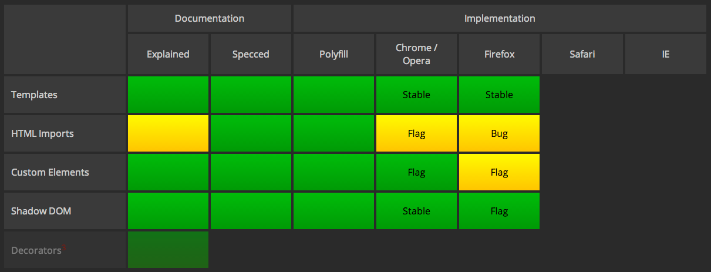

# Polymer Project ve Web Compoents - 2

Polymer Projesi ve Web Components teknolojilerini incelediğim yazıma 2. bölümüyle devam ediyorum:


- [Bileşen Kütüphanesi](#bilesen-kutuphanesi)
- [Web Components](#web-components)
  - [Templates](#templates)
  - [Custom Elements](#custom-elements)
  - [Shadow DOM](#shadow-dom)
  - [Imports](#imports)
- [Polymer Polyfills](#polymer-polyfills)
- [İlgili Bağlantılar](#ilgili-baglantilar)

Polymer Projesi aşağıdaki 3 parçadan oluşuyor:


 - Bileşen Kütüphanesi: Web uygulamalarında kullanıma hazır Görsel bileşen kütüphaneleri ve faydalı araçlar seti.
 - Uygulama Mimarisi: Çok yeni olan 4 W3C teknolojisini uygulayan bir Modern Web Uygulama Mimarisi
 - Polymer Polyfills: Web Components özelliklerini henüz tanımayan tarayıcıları bu özellikleri varmış gibi uyumlandıran kütüphane.


<a name="bilesen-kutuphanesi"></a>
### Bileşen Kütüphanesi

Polymer ve Web Components teknolojisi ile tam olarak neler yapabilceğini göstermek için Google tarafından geliştirilen son derece göz alıcı 3 demoya göz atabilirsiniz:

[Topeka](https://github.com/googlearchive/topeka)

Paper elements projesinde sunulan temel görsel bileşenleri kullanan bir quiz uygulaması.


> Paper elements projesinde sunulan temel görsel bileşenleri kullanan bir quiz uygulaması.

[Calculator](https://github.com/googlearchive/paper-calculator/blob/master/demo.html)

Mürekkep etkisi olarak isimlendirilen görsel efektin ağırlıklı olduğu örnek hesap makinesi uygulaması.

[Paper Elements](https://www.webcomponents.org/collection/polymerelements/paper-elements)

Polymer bileşenleri ile birlikte Material Design kavramını da örnekleyen demo uygulaması.

> Örnek uygulamaları Chrome 32 ve üzerinde mükemmele yakın olarak görüntüleyebiliyor olacaksınız. Bununla birlikte en iyi sonuçlar için Chrome Canary önerilir:
>  
>   http://www.google.com/intl/en/chrome/browser/canary.html

<a name="web-components"></a>
### Web Components

Web Components bileşen modeli, aşağıdaki 4 parçadan oluşur:

<a name="templates"></a>
##### 1- Templates

`<template>` isimli HTML tag'ları içerisinde yer alan HTML kodu döküman içerisinde yer almasına rağmen, kullanıcı çağırmadıkça aktif hale getirilmez (Parsing gerçekleşmez). 

```html
<template id="commentTemplate">
    <div>
        
        <div class="comment-text"></div>
    </div>
</template>
```

<a name="custom-elements"></a>
##### 2- Custom Elements

Geliştiricilere diledikleri HTML tag tanımını yapmalarını ve kod içerisinde herhangi bir HTML tag'ı gibi kullanabilmelerini sağlar.

```js
var p = Object.create(HTMLButtonElement.prototype);
var FancyButton = document.registerElement('fancy-button',
                                           {extends: 'button', prototype: p});

```


```html
<fancy-button>Click Me</fancy-button>
```
<a name="shadow-dom"></a>
##### 3- Shadow DOM

Herhangi bir HTML tag'ı içerisindeki iç HTML içeriği görünür hale getirilir (Render işlemi gerçekleşir) ancak içerdeki bu HTML, DOM ağacında yer almaz, bunun yerine Shadow DOM ismi verilen ayrı bir context'de yer alırlar. Bu sayede, Shadow DOM içindeki bileşenlerin style ve id değerleri, esas DOM içerisinde yer alan bileşenlerle karışma riski ortadan kalkmış olur.

```html
<button>Hello, world!</button>
<script>
var host = document.querySelector('button');
var root = host.createShadowRoot();
root.textContent = 'こんにちは、影の世界!';
</script>
```

> Yukarıdaki kod ekrana "Hello World" yerine " 'こんにちは、影の世界!' yazacaktır!

<a name="imports"></a>
##### 4- Imports

Standart HTML'de CSS ve JavaScript içeriklerinin dinamik olarak farklı kanallardan aktarılması örneğindeki gibi HTML içerikli dosyaların sayfa içeriğine aktarılmasını sağlar. iframe ile aynı amaca yönelik olsa da performans, açısından ve iframe'e özgü stil sorunlarını çözmesi açısından yenilikçi bir çözümdür. 

```html
<link rel="import" href="google-map.html">
```

> Web Components Modeli ile ilgili daha fazla bilgi için W3C dökümanını incelemenizi öneririm:
>  
>  http://w3c.github.io/webcomponents/explainer/

<a name="polymer-polyfills"></a>
#### Polymer Polyfills

> Polyfill Nedir?
>
>  Bir internet tarayıcısının desteklemediği özellikleri tarayıcıya kazandırmak amacını taşıayan, indirilebilir kod paketleridir.

Polymer kütüphanesinde yer alan çeşitli Polyfill'ler, henüz Web Components teknolojisini desteklemeyen tarayıcılarda bu özellikleri sağlamaya yarıyorlar. Zamanla tarayıcıların Web Components teknolojilerini uygulamaya alması ile birlikte Polymer bir kütüphane olarak yaptığı görevi tamamlayarak aradan çekilecek ve Web Components modelini Web dünyassına kazandırmış olacak. 

2014 Temmuz itibariyle yaygın Internet tarayıcılarının Web Components standartlarını uygulama durumları aşağıdaki gibi:



Güncel tablo için: http://jonrimmer.github.io/are-we-componentized-yet/

<a name="ilgili-baglantilar"></a>
#### İlgili Bağlantılar

- http://webcomponents.org/
- http://html5-demos.appspot.com/static/cds2013/index.html#4
- http://w3c.github.io/webcomponents/explainer/
- https://www.google.com/events/io/schedule/session/de22e147-07b6-e311-8491-00155d5066d7
- http://code.tutsplus.com/tutorials/using-polymer-to-create-web-components--cms-20475
- http://robdodson.me/webcomponents-revolution/#/
- http://html5-demos.appspot.com/static/polymer/index.html#1
- http://w3c.github.io/webcomponents/explainer/#template-section
- http://tamas.io/x-flickr-custom-polymer-element/
