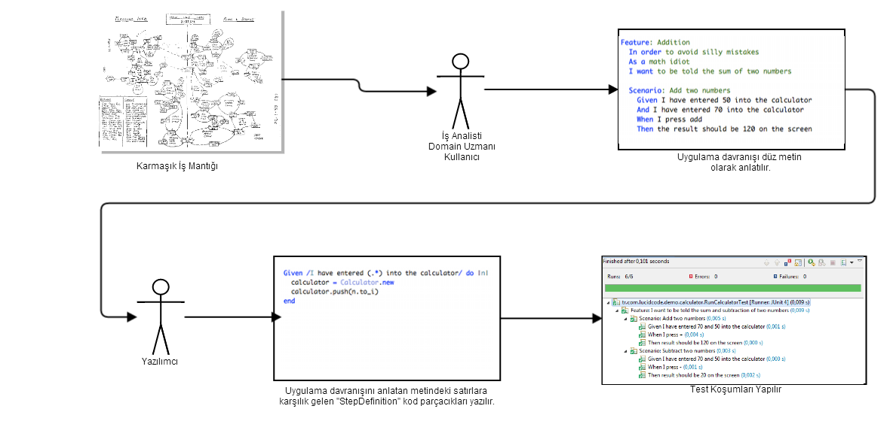

### Cucumber Nedir?

Düz metin olarak tanımlanmış kullanım senaryolarını otomatize edilmiş testlere dönüştüren bir araçtır.

Her ne kadar Cucumber bir test koşum aracı gibi yorumlanabilse de, Cucumber'ın asıl amacı Uygulama Davranışı Odaklı Geliştirme diye tarif edebileceğim [Behavior Driven Development (BDD)](http://behaviour-driven.org/) yaklaşımını temel alan bir süreci desteklemektir. 

Buna göre, "testler" (aslında düz metin olarak yazılmış uygulama kullanım senaryoları), henüz geliştirme başlamadan önce iş analistleri, domain uzmanları ya da kullanıcılar veya müşteriler tarafından kaleme alınmalıdır.

Sonrasinda ise yazılımcı, ilgili test senaryolarını yerine getirecek ve ilgili testleri geçebilecek kodları yazar.


 ### Hızlı Başlangıç
 
 Cucumber'ın bize sağladığı en büyük fayda, uygulama davranışının neredeyse düz metin olarak belirlendiği (Bkz: [Gherkin Dili](https://github.com/cucumber/cucumber/wiki/Gherkin) Feature ve Screnario cümlelerinin Java ya da başka dillere ait platformlarda koşulabilir birim testlere kolayca dönüştürülebilmesidir. Uygulama davranışının anlatıldığı feature dosyalarının yazılması ve okunması için kesinlikle programlama bilgisi gerekmemekte, bu sayede, program geliştirmeyen bir kişi de birim testlerin kapsamını ve sınırlarını belirlemek üzere test sürecine etkin bir şekilde dahil olabilmektedir.
 
 Behavior Driven Development, Cucumber ile aşağıdaki şekilde gerçekleşir:
 
 1. Test edilecek kodun beklenen davranışı düz metin olarak yazılır.
 2. Testi gerçekleştirecek olan birkaç Step definition yazılır.
 3. Teste tabi olacak kod yazılır.
 4. Test çalıştırılır.
 
 
 
 Aşağıda anlatacağım örnek uygulama üzerinden Cucumber'dan nasıl faydalanabileceğimizi daha yakından görebiliriz.
 
 ### Örnek Uygulama: Hesap Makinesi
 
 Çok basit bir hesap makinesi uygulaması yazılması gerektiğini varsayalım. İş biriminden gelen talebe göre,
 
 İki sayının toplanabilmesi mümkün kılınmalıdır.
 Aynı zamanda bu iki sayı ile çıkarma işlemi yapılabilmelidir.
 Bu ihtiyaçlar ışığında Cucumber ile önce testleri oluşturup sonra uygulamayı yazacağız.

> Aşağıdaki adımlarda oluşturulacak proje yapısının tamamına github üzerinden de erişebilirsiniz:
>  
> https://github.com/omerg/cucumber-bdd-example 

##### Ön Gereksinimler:
 - Eclipse IDE (m2e Maven Eklentisi ile).
 - Başlangıç seviyesinde Java bilgisi.

##### Dosya Yapısı:
Eclipse üzerinde New -> Java Project seçimi yaparak yeni bir proje oluşturun. Oluşan proje içerisinde aşağıdaki dizin yapısını oluşturun.

```
cucumber-bdd-example
|-- pom.xml
`-- src
    |-- main
    |   `-- java
    |       `-- tr.com.lucidcode.demo.calculator
    |                           `-- Calculator.java
    `-- test
        |-- java
        |   `-- tr.com.lucidcode.demo.calculator
        |                       |-- RunCukesTest.java
        |                       `-- StepDefinitions.java
        `-- resources
            `-- tr.com.lucidcode.demo.calculator
                                `-- calculator.feature
```

Pom.xml dosyası içerisine aşağıdaki XML içeriğini kopyalayın:

```xml
<project>
    <modelVersion>4.0.0</modelVersion>
    <groupId>tr.com.lucidcode.demo.cucumber</groupId>
    <artifactId>cucumber-bdd-example</artifactId>
    <version>1.0-SNAPSHOT</version>
    <dependencies>
        <dependency>
            <groupId>info.cukes</groupId>
            <artifactId>cucumber-java</artifactId>
            <version>1.1.7</version>
            <scope>test</scope>
        </dependency>
        <dependency>
            <groupId>info.cukes</groupId>
            <artifactId>cucumber-junit</artifactId>
            <version>1.1.7</version>
            <scope>test</scope>
        </dependency>
        <dependency>
            <groupId>junit</groupId>
            <artifactId>junit</artifactId>
            <version>4.11</version>
            <scope>test</scope>
        </dependency>
    </dependencies>
</project>
```

Bu yazıda dosya hiyerarşisini oluşturduk. [Bir sonraki yazıda](/cucumber-ile-behavior-driven-development-22/) uygulamanın içini dolduralım.
