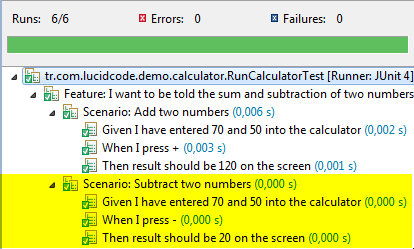

### Cucumber Nedir?

Düz metin olarak tanımlanmış kullanım senaryolarını otomatize edilmiş testlere dönüştüren bir araçtır.

Her ne kadar Cucumber bir test koşum aracı gibi yorumlanabilse de, Cucumber'ın asıl amacı Uygulama Davranışı Odaklı Geliştirme diye tarif edebileceğim [Behavior Driven Development (BDD)](http://behaviour-driven.org/) yaklaşımını temel alan bir süreci desteklemektir. 

Buna göre, "testler" (aslında düz metin olarak yazılmış uygulama kullanım senaryoları), henüz geliştirme başlamadan önce iş analistleri, domain uzmanları ya da kullanıcılar veya müşteriler tarafından kaleme alınmalıdır.

Sonrasinda ise yazılımcı, ilgili test senaryolarını yerine getirecek ve ilgili testleri geçebilecek kodları yazar.


 ### Hızlı Başlangıç
 
 Cucumber'ın bize sağladığı en büyük fayda, uygulama davranışının neredeyse düz metin olarak belirlendiği (Bkz: [Gherkin Dili](https://github.com/cucumber/cucumber/wiki/Gherkin) Feature ve Screnario cümlelerinin Java ya da başka dillere ait platformlarda koşulabilir birim testlere kolayca dönüştürülebilmesidir. Uygulama davranışının anlatıldığı feature dosyalarının yazılması ve okunması için kesinlikle programlama bilgisi gerekmemekte, bu sayede, program geliştirmeyen bir kişi de birim testlerin kapsamını ve sınırlarını belirlemek üzere test sürecine etkin bir şekilde dahil olabilmektedir.
 
 Behavior Driven Development, Cucumber ile aşağıdaki şekilde gerçekleşir:
 
 1. Test edilecek kodun beklenen davranışı düz metin olarak yazılır.
 2. Testi gerçekleştirecek olan birkaç Step definition yazılır.
 3. Teste tabi olacak kod yazılır.
 4. Test çalıştırılır.
 
 
 
 Aşağıda anlatacağım örnek uygulama üzerinden Cucumber'dan nasıl faydalanabileceğimizi daha yakından görebiliriz.
 
 ### Örnek Uygulama: Hesap Makinesi
 
 Çok basit bir hesap makinesi uygulaması yazılması gerektiğini varsayalım. İş biriminden gelen talebe göre,
 
 İki sayının toplanabilmesi mümkün kılınmalıdır.
 Aynı zamanda bu iki sayı ile çıkarma işlemi yapılabilmelidir.
 Bu ihtiyaçlar ışığında Cucumber ile önce testleri oluşturup sonra uygulamayı yazacağız.

> Aşağıdaki adımlarda oluşturulacak proje yapısının tamamına github üzerinden de erişebilirsiniz:
>  
> https://github.com/omerg/cucumber-bdd-example 

##### Ön Gereksinimler:
 - Eclipse IDE (m2e Maven Eklentisi ile).
 - Başlangıç seviyesinde Java bilgisi.

##### Dosya Yapısı:
Eclipse üzerinde New -> Java Project seçimi yaparak yeni bir proje oluşturun. Oluşan proje içerisinde aşağıdaki dizin yapısını oluşturun.

```
cucumber-bdd-example
|-- pom.xml
`-- src
    |-- main
    |   `-- java
    |       `-- tr.com.lucidcode.demo.calculator
    |                           `-- Calculator.java
    `-- test
        |-- java
        |   `-- tr.com.lucidcode.demo.calculator
        |                       |-- RunCukesTest.java
        |                       `-- StepDefinitions.java
        `-- resources
            `-- tr.com.lucidcode.demo.calculator
                                `-- calculator.feature
```

Pom.xml dosyası içerisine aşağıdaki XML içeriğini kopyalayın:

```xml
<project>
    <modelVersion>4.0.0</modelVersion>
    <groupId>tr.com.lucidcode.demo.cucumber</groupId>
    <artifactId>cucumber-bdd-example</artifactId>
    <version>1.0-SNAPSHOT</version>
    <dependencies>
        <dependency>
            <groupId>info.cukes</groupId>
            <artifactId>cucumber-java</artifactId>
            <version>1.1.7</version>
            <scope>test</scope>
        </dependency>
        <dependency>
            <groupId>info.cukes</groupId>
            <artifactId>cucumber-junit</artifactId>
            <version>1.1.7</version>
            <scope>test</scope>
        </dependency>
        <dependency>
            <groupId>junit</groupId>
            <artifactId>junit</artifactId>
            <version>4.11</version>
            <scope>test</scope>
        </dependency>
    </dependencies>
</project>
```

### 1 - Test senaryosu yazılır

calculator.feature isimli bir dosya oluşturulur ve tercihen src/test/resources altında yer alan Java Package'a yerleştirilir.

calculator.feature dosyası içerisinde daha önce de değindiğmiz test senaryosu yazılır:

> src/test/resources/tr/com/lucidcode/demo/calculator/calculator.feature
> ```
> Feature: I want to be told the sum of two numbers
>  
>   Scenario: Add two numbers
>     Given I have entered 70 and 50 into the calculator
>     When I press add
>    Then result should be 120 on the screen
>```

Feature dosyaları [Gherkin](https://github.com/cucumber/cucumber/wiki/Gherkin) olarak adlandırılan basit bir kural kümesini temel alır. Buna göre feature dosyası 2 ana bölümden oluşur:

#### Feature:

"Feature" kelimesiyle başlar, düz metin ile devam eder. Birden fazla satırdan oluşabilir.

 - Uygulamanın genel işleyişini kapsayan ve kullanıcıya sağladığı faydalardan birini anlatan bir açıklama metnidir. 
 - Kendisine bağlı olan "Scenario" parçaları, bu "Feature"ın teknik olarak hangi işlemler aracılığıyla mümkün kılındığını açıklar.
 - Feature alanının en önemli kullanım amacı, kendisine bağlı olan tüm senaryo parçalarını özetlemesidir.

#### Scenario:

 - "Scenario" kelimesiyle başlar, tercihen bir satırlık bir açıklama cümlesi ile devam eder.
 - "Given", "And", "When", "Then" gibi anahtar kelimelerle başlayan ve yapılması gereken işi ifade eden alt cümleciklerden oluşur. Bu cümleciklerin her birine "Step Definition" denir.

### 2 - Step Definiton'lar yazılır

Test senaryosunu çalıştırabilmek için aşağıdaki standart kod parçacığı kullanılır:

> src/test/java/tr/com/lucidcode/demo/calculator/RunCukesTest.java
> ```java
> package tr.com.lucidcode.demo.calculator;
>  
> import cucumber.api.junit.Cucumber;
> import org.junit.runner.RunWith;
>  
> @RunWith(Cucumber.class)
> public class RunCalculatorTest {
> }
>```

Test senaryosunu oluşturan her bir cümleciğin, yani "StepDefiniton" tanımının karşılık geldiği bir Java metodu oluşturulması gerekiyor. Birinci adımda gördüğümüz feature dosyasını hatırlayalım; bu dosyada yer alan senaryoları oluşturan her bir cümle aşağıdaki örnekte yer alan StepDefinitions.java sınıfı içerisinde tanımlanmıştır:

> src/test/java/tr/com/lucidcode/demo/calculator/StepDefinitions.java
> ```java
> package tr.com.lucidcode.demo.calculator;
>   
> import static org.hamcrest.CoreMatchers.equalTo;
> import static org.junit.Assert.assertThat;
> import cucumber.api.java.en.Given;
> import cucumber.api.java.en.Then;
> import cucumber.api.java.en.When;
>   
> public class StepDefinitions {
>     private Calculator calculator;
>   
>     @Given("^I have entered (\\d+) and (\\d+) into the calculator$")
>     public void i_have_entered_into_the_calculator(Integer firstNumber, Integer secondNumber) throws Throwable {
>         calculator = new Calculator();
>         calculator.firstNumber = firstNumber;
>         calculator.secondNumber = secondNumber;
>     }
>   
>     @When("^I press (.*)$")
>     public void i_press(String operator) throws Throwable {
>         calculator.operator = operator;
>     }
>   
>     @Then("^result should be (\\d+) on the screen")
>     public void result_should_be(Integer expectedResult) throws Throwable {
>         assertThat(calculator.performOperation(), equalTo(expectedResult));
>     }
> }
>```

Gördüğünüz gibi üç adet metod mevcut. Her biri "Add Two Numbers" isimli senaryoda yer alan adımlara karşılık geliyor. Her bir metod bir Gherkin anahtar kelimesiyle ("Given", "When", "Then") annotate edilmiş durumda. Aynı zamanda her annotation birer Regular Expression içeriyor. Buna göre ilgili test cümleciği içerisinde değişken sayılar ve kelimeler kullanılabiliyor.

Örneğin birinci metod, yani `i_have_entered_into_the_calculator`, metod isminin önünde yer alan annotation sayesinde, feature dosyasında yer alan `"Given I have entered 70 and 50 into the calculator"` Step Definition cümlesiyle eşleşiyor. Bu sayede ilgili Step Definition cümlesinden 2 adet parametre alıyor:

 - FirstNumber = 70
 - SecondNumber = 50
 
 ### 3 - Hesap Makinesi Kodu Yazılır
 
 [Test Driven Development](http://en.wikipedia.org/wiki/Test-driven_development) yaklaşımında olması gerektiği gibi, asıl kodu yazmayı en sona bıraktık. Bu sayede kodu yazmaya başlarken çıkış noktamız, test koşullarını sağlamak olacak.
 
 Yazılacak kod çok basit bir şekilde iki sayıyı toplayıp çıkarabilen bir hesap makinesi uygulaması (Kodu mümkün olduğunca sade kılmak için getter/setter kullanımını es geçtim):
 
 > src/main/java/tr/com/lucidcode/demo/calculator/Calculator.java
 > ```java
> package tr.com.lucidcode.demo.calculator;
>  
> public class Calculator {
>      
>     public Integer firstNumber;
>     public Integer secondNumber;
>     public String operator;
>  
>     public Integer performOperation() {
>         if ("+".equals(this.operator)) {
>             return firstNumber + this.secondNumber;
>         } else {
>             return firstNumber - this.secondNumber;
>         }      
>     }
> }
>```
 
 ### 4 - Örnek test çalıştırılır
 
 Testleri çalıştırmak için Eclipse üzerinde ilgili proje sağ tıklanır ve Run As -> JUnit seçimi yapılır:
 
 Test sonuçları, Eclipse'de yer alan JUnit penceresinde karşımıza çıkar:
 
 

 ### Best Practice: Tekrar Kullanım
 
 Test senaryolarından ve Step Definition'lardan en etkin biçimde faydalanmanın yolu, onları tekrar tekrar kullanabilmeye müsait yapılar kurmaktır.
 
 Aşağıda görülen "Subtract two numbers" senaryosunu calculator.feature dosyasına eklediğmizde, yeni Step Definition'lar yazmaksızın, elimizdeki Step Definition'ların değişken yapısını kullanarak yeni bir test yapabiliyor olabileceğiz:
 
 ```
 Feature: I want to be told the sum and subtraction of two numbers
   
   Scenario: Add two numbers
     Given I have entered 70 and 50 into the calculator
     When I press +
     Then result should be 120 on the screen
      
   Scenario: Subtract two numbers
     Given I have entered 70 and 50 into the calculator
     When I press -
     Then result should be 20 on the screen
 ```
 
 Tekrar testleri başlattığımızda (Sağ Click -> Run As -> JUnit) aşağıdaki yeni sonuçlarla karşılaşacağız: 
 
  
  
### Sonuç
  
  Bu örnek Cucumber'ın sadece temel özelliklerini anlatan ve temel olarak Behavior Driven Development kavramını irdeleyen bir örnekti. Eğer örneği daha da sindirerek öğrenmek isterseniz feature dosyasındaki sayıları ya da + / - işaretlerini değiştirip testi geçecek bir kod yazma sürecine girmenizi tavsiye ederim. 
  
  Cucumber ile diğer yapabilecekleriniz (Aklıma gelen birkaçı):
  
   - [Selenium](http://docs.seleniumhq.org/docs/01_introducing_selenium.jsp) entegrasyonu ile ekran testleri
   - Feature dosyalarının Türkçe yazılması
   - Liste halinde verilen değişkenler ile testlerin tekrar tekrar koşumu
   
### Kaynaklar

Cucumber ile ilgili elimizde yeter ki miktarda kaynak olduğunu gönül rahatlığı ile söyleyebiliriz:

 - http://www.cihataltuntas.com/test-driven-development/
 - http://teachmetocode.com/screencasts/introduction-to-outside-in-development-with-cucumber/
 - http://cukes.info/
 - [Cucumber Github Sayfası](https://github.com/cucumber)
 - [Tutorials and Related Blogs](https://github.com/cucumber/cucumber/wiki/Tutorials-and-Related-Blog-Posts)
 - http://thomassundberg.wordpress.com/2014/05/29/cucumber-jvm-hello-world/
 - http://cukes.info/step-definitions.html
 - https://github.com/cucumber/cucumber/wiki
 - http://dannorth.net/whats-in-a-story/  
