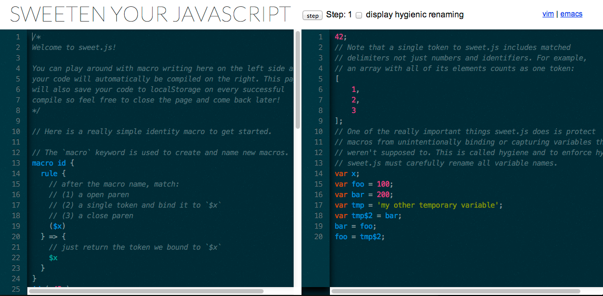

 <a name="intro"></a>
### Intro

The past few years have been very bright for JavaScript. A few years ago, JavaScript did not get the reputation it deserved, but now it has become a platform that has been used and supported by the masses, and the standardization work has been more intense and faster than ever before. Of course, the developments in the web platform have a great contribution to this situation; especially the contributions of [node.js] (http://nodejs.org/)

Innovations of varying sizes are brought by "Harmony" code named [EcmaScript 6 (ES6)](https://developer.mozilla.org/en/docs/Web/JavaScript/ECMAScript_6_support_in_Mozilla) project, such as ["let"](http://ariya.ofilabs.com/2013/05/es6-and-block-scope.html) notation or [Generators](http://modernweb.com/2014/02/10/replacing-callbacks-with-es6-generators/) technology. All these innovations will strengthen the location of JavaScript in the near future.

JavaScript tarafında ES6 haberleri gerçekten heyecan verici. Fakat benim için en az bir o kadar heyecan verici birşey daha var ki, o da  isimli küçük bir kütüphane.

The ES6 news on the JavaScript world is really exciting. But there is on thing that is as much exciting as ES6 for me, and that iss a small library called [sweet.js](https://github.com/mozilla/sweet.js).


Sweet.js, as I mentioned, has a very small library and the only job it does is to provide macro writing with JavaScript. Some may not be very hopeful at this moment, because the macro is a technology that can pave the way for bad code habits, and in this sense, its record of wrong usage is rather bulky.

And what about macros when it comes to JavaScript? Is it possible that macros can be beneficial when writing JavaScript code? I think the answer to this question is definitely yes. In this article, I will tell you why I said yes.

 - [Intro](#intro)
 - [Proper Usage of Macros](#proper-usage-of-macros)
 - [A Little Bit of History](#a-little-bit-of-history)
 - [A Simple Macro](#a-simple-macro)
 - [Further Reading](#further-reading)
 
 <a name="proper-usage-of-macros"></a>
 ### Proper Usage of Macros
 
First of all, let's avoid possible confusion. Because when we navigate through different programming languages, we realize that the word "macro" actually corresponds to different concepts. 

For example, the code fragments that start with "#define", which we often come across in program C, are called "macro"s:

```c
//'foo' gorulen yerlere '5' yerlestirilir
#define foo 5
```

But that's definitely not the macro I'm talking about. 

`#define foo 5` is a form of usage, which merely allows a simple text scan and replacement. This type of text replacement does not look at the code structure at all. Many programming languages ​​have named the "macro" the ability to replace text at this level.

What I mean when I say "macro" in this article is the following:
                                                        
> If a small snippet of code is able to parse and convert specific fields within the underlying code, then these code snippets are called "macro".

 <a name="a-little-bit-of-history"></a>
 ### A Little Bit of History

In the real sense, "macro" was first introduced in the 1970s with the concept of "[defmacro](http://cl-cookbook.sourceforge.net/macros.html)", which we saw in the [Lisp](http://en.wikipedia.org/wiki/Lisp_(programming_language) programming language. It was no coincidence for Lisp to own such a valuable feature, because its own source code, which contains the grammar rules that Lisp uses, was written using its own data structures.

By supporting Lisp language with small macros, it was being possible to enhance the functional capabilities of the language an this way, Lisp ecosystem was constantly evolving.

Now let's take a closer look at the sweet.js library, which makes the real use of Lisp type macro usage possible with JavaScript:

> You can start using the [Online Editor](http://sweetjs.org/browser/editor.html) below to begin testing the Sweet.js macros:
>
> 

 <a name="a-simple-macro"></a>
 ### A Simple Macro
 
 By using the `macro` keyword, a new macro can be defined as follows. Let's look at the simple example below:

```
macro id {
  rule {
    // after hitting the macro keyword, match the following:
    // (1) open brackets.
    // (2) read single char and assign value to `$x` variable.
    // (3) close brackets.
    ($x)
  } => {
    // Sadece `$x` değişkenine atadığımız değeri dön:
    $x
  }
}
```

If the macro named 'id' is used in the compilation phase, the following line of code will return 42 to the console:

```javascript
id ( 42 );

//Console Output
>42
```

With this simple example, we are now familiar with the JavaScirpt macro's. Macro's can have many uses; Some of them are rapid prototyping or algorithm, but macros definitely have the potential to offer you more. It's up to your imagination.

[In the next post](/javascript-and-macro-usage-22) I will introduce some more advanced examples.

 <a name="further-reading"></a>
### Further Reading

 - http://sweetjs.org/
 - https://github.com/mozilla/sweet.js
 - [Stop Writing JavaScript Compilers! Make Macros Instead](http://jlongster.com/Stop-Writing-JavaScript-Compilers--Make-Macros-Instead)
 - http://disnetdev.com/blog/2012/12/20/how-to-read-macros/
 - https://github.com/mozilla/sweet.js/wiki/Example-macros
 - http://sweetjs.org/browser/editor.html
 - http://www.paulgraham.com/onlisp.html
