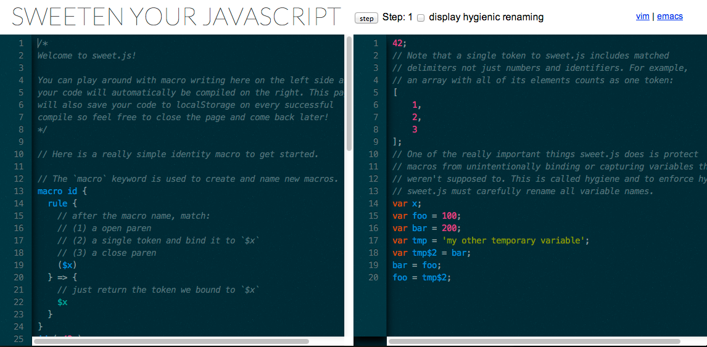

### Giriş

Geçtiğimiz birkaç yıl JavaScript için çok parlak geçti. Birkaç yıl öncesinde JavaScript beklediği itibarı pek de görmüyordu, şimdilerde ise geniş kitleler tarafından kullanılan ve desteklenen, üzerinde standartlaştırma çalışmalarının şimdiye dek hiç olmadığı kadar yoğun ve hızlı olduğu bir platforma dönüştü. Tabi ki Web platformunda yaşanan gelişmelerin oluşan bu duruma büyük katkısı var; hele ki [node.js](http://nodejs.org/) in katkıları hiç de azımsanacak gibi değil.

Harmony kod adlı [EcmaScript 6 (ES6)](https://developer.mozilla.org/en/docs/Web/JavaScript/ECMAScript_6_support_in_Mozilla) ile birlikte gelen [Generators](http://modernweb.com/2014/02/10/replacing-callbacks-with-es6-generators/) teknolojisi ve ["let"](http://ariya.ofilabs.com/2013/05/es6-and-block-scope.html) ifadesi bunlardan gibi irili ufaklı pek çok yenilik, JavaScript'in yakın gelecekteki yerini daha da sağlamlaştıracak.

JavaScript tarafında ES6 haberleri gerçekten heyecan verici. Fakat benim için en az bir o kadar heyecan verici birşey daha var ki, o da [sweet.js](https://github.com/mozilla/sweet.js) isimli küçük bir kütüphane.


Sweet.js, bahsettiğim gibi çok küçük bir kütüphane ve yaptığı yegane bir iş var, JavaScript ile macro yazımını sağlamak. Kimileri bu gelişmeden ilk anda çok ümitli olmayabilir, çünkü macro'lar, kötü kod alışkanlıklarının önünü açabilen bir teknolojidir ve bu anlamda sicili oldukça kabarıktır. 

Peki JavaScript söz konusu olduğunda macro'lar işimize yarayabilir mi? Bence bu sorunun cevabı kesinlikle evet. Bu yazıda da neden evet dediğimi anlatacağım.

 - [Giriş](#giris)
 - [Doğru Macro Kullanımı](#dogru-macro-kullanimi)
 - [Biraz Tarihçe](#biraz-tarihce)
 - [Basit bir Macro](#basit-bir-macro)
 - [Örnek: Class Syntax](#ornek-class-syntax)
 - [Sonuç](#sonuc)
 - [İlgili Yazılar](#ilgili-yazilar)
 - [İlginizi Çekebilecek Diğer Konular](#ilginizi-cekebilecek-diger-konular)
 
 <a name="dogru-macro-kullanimi"></a>
 ### Doğru Macro Kullanımı
 
 Öncelikle olası kavram karışıklıklarının önüne geçelim. Şöyle ki, farklı programlama dilleri arasında gezindiğimizde "macro" sözcüğünün aslında farklı kavramlara karşılık geldiğini farkederiz. Hal böyleyken bu yazıda "macro" dediğimde ne demek istedğimi önden açıklayayım:
 
> Önceden tanımlanan küçük bir kod parçacığı, esas kod içerisinde belirli alanları ayrıştırabiliyor ve bu alanları dönüştürebiliyor ise işte bu kod parçacıklarına "macro" diyebiliriz.

Örneğin C programlana dilinde sıkça rastladığımız "#define" ile başlayan kod parçalarına "macro" denir:

```c
//'foo' gorulen yerlere '5' yerlestirilir
#define foo 5
```

Fakat benim bahsedeceğim macro kesinlikle  bu değil.

"#define foo 5" şeklindeki bir kullanım, olsa olsa basit bir metin taraması ve yer değiştirmesi sağlar. Haliyle bu tip bir metin yer değiştirmesi, kod yapısına hiç mi hiç bakmaz. Pek çok programlama dili de bu seviyede bir yer değiştirme yeteneğine "macro" ismini vermiştir.

 <a name="biraz-tarihce"></a>
 ### Biraz Tarihçe

Oysa ki gerçek anlamda "macro", 1970'lerde [Lisp](http://en.wikipedia.org/wiki/Lisp_(programming_language)) programlama dilinde gördüğümüz "[defmacro](http://cl-cookbook.sourceforge.net/macros.html" konsepti ile ilk defa yaygınlaşmıştı. Böylesine değerli bir program özelliğinin Lisp'e ait olması son derece doğaldı; çünkü Lisp'in kullandığı dilbilgisi kurallarını içeren kendi kaynak kodu, yine kendisine ait veri yapıları kullanılarak yazılmıştı. Lisp programlarını küçük macro'lar ile destekleyerek kodun işlevini değiştirebilmek mümkün oluyor, bu sayede Lisp ekosistemi sürekli bir şekilde gelişiyordu.

Şimdi Lisp tipinde gerçek macro kullanımını JavaScript ile mümkün kılan sweet.js kütüphanesine daha yakından bakalım:

> Aşağıda örnekleri verilen Sweet.js macro'larını test etmeye hemen başlamak için [Online Editor'u](http://sweetjs.org/browser/editor.html) kullanabilirsiniz:
>
> 

 <a name="basit-bir-macro"></a>
 ### Basit Bir Macro
 
 `macro` anahtar sözcüğü kullanılarak aşağıdaki gibi yeni bir macro tanımlanabilir. Aşağıdaki basit örneğin nasıl bir eşleşme yaptığına bakalım:

```javascript
macro id {
  rule {
    // macro ismini gördükten sonra aşağıdakilerle eşleş:
    // (1) ac parantez.
    // (2) tek karakter oku ve `$x` değişkenine ata.
    // (3) kapa parantez.
    ($x)
  } => {
    // Sadece `$x` değişkenine atadığımız değeri dön:
    $x
  }
}
```

Yukarıdaki 'id' isimli makro'nun derleme aşamasında kullanılması durumunda aşağıdaki kod satırı, konsola 42 değerini dönecekir:

```javascript
id ( 42 );

//Console Output
>42
```

Bu basit örnek ile JavaScirpt macro'larını yapısal olarak tanıdık. Macro'ların pek çok kullanım alanı olabilir; hızlı prototipleme ya da algoritma yazmak bunlardan bazıları, ama macro'lar kesinlikle size daha fazlasını sunabilecek potansiyele sahip. Burada iş tamamen sizin hayal gücünüze kalmış.

Şimdi daha çarpıcı bir örnek sunalım:

 <a name="ornek-class-syntax"></a>
#### Örnek: Class Syntax

Diyelim ki bir JavaScript nesnesi yaratmak istiyorsunuz. JavaScript ile bu işlemi yapmak için prototype alanını kullanarak aşağıdaki kodu yazarsınız:

```javascript
function Person(name) {
    this.name = name;
}
Person.prototype.say = function(msg) {
    console.log(this.name + " says: " + msg);
}
```

Yukarıda tanımlanan Person nesnesi ve "say" metodu, aşağıdaki gibi kullanılabilir:

```javascript
var you = new Person("Omer");
you.say("I love JavaScript!");

//Console Output
>Omer says: I love JavaScript!
```

Peki aynı nesneyi "class" syntax'ı ile yazmak istersek? Bunun için üç seçeneğimiz var:

 1. JavaScript'ten ayrılıp Java ile yazmaya devam etmek. (smile)
 2. ES6 Standartlarının yaygınlaşmasını beklemek.
 3. sweet.js kullanmak.

sweet.js sayesinde Java benzeri "class" sözdizimi kullanarak nesne oluşturmak isterseniz birkaç satırlık bir macro tanımlamanız yeterli:

```javascript
macro class {
 
  rule {
 
    $className {
        constructor $cparams $cbody
        $($mname $mparams $mbody) ...
    }
 
  } => {
 
    function $className $cparams $cbody
 
    $($className.prototype.$mname
      = function $mname $mparams $mbody; ) ...
 
  }
}
```

İşte bu kadar. Artık JavaScript ile "class" tanımlayabilirsiniz:

```javascript
class Person {
  constructor(name) {
    this.name = name;
  }
  say(msg) {
    console.log(this.name + " says: " + msg);
  }
}
var you = new Person("Omer");
you.say("Macros are sweet!");
```
Console:
```javascript
>Omer says: Macros are sweet!
```
 <a name="sonuc"></a>
### Sonuç

sweet.js in son derece güçlü bir araç olduğunu düşünüyorum ve açıkçası ilk gördüğümde JavaScript için geleceğine macro'ların yön verebileceği hissine kapıldım. Macro kavramı ile birlikte gündeme gelen Macro Hygiene konusunu ve macro kullanımının Google Closure Compiler ve benzeri derleyicilerin yerine geçme olasılığına başka bir yazıda değinebilirim. 

Bu arada örnekler ilginizi çektiyse daha fazla Makro örneğini inceleyebilirsiniz:

> *(Listede yer alan tamamen muzurluk amaçlı yapılmış "Randomly Disappearing Code" macro örneğini şiddetle tavsiye ederim. :smiley: )

 <a name="ilgili-yazilar"></a>
### İlgili Yazılar

 - http://sweetjs.org/
 - https://github.com/mozilla/sweet.js
 - [Stop Writing JavaScript Compilers! Make Macros Instead](http://jlongster.com/Stop-Writing-JavaScript-Compilers--Make-Macros-Instead)
 - http://disnetdev.com/blog/2012/12/20/how-to-read-macros/
 - https://github.com/mozilla/sweet.js/wiki/Example-macros
 - http://sweetjs.org/browser/editor.html
 - http://www.paulgraham.com/onlisp.html
 - http://en.wikipedia.org/wiki/Hygienic_macro
 - http://jlongster.com/Writing-Your-First-Sweet.js-Macro
 - http://jlongster.com/Compiling-JSX-with-Sweet.js-using-Readtables
 - https://mail.mozilla.org/pipermail/es-discuss/2008-August/006837.html
 - http://www.okanakyuz.com/lisp-notlari-giris/
 - http://blog.fatihak.in/sweet-js-ile-javascript-macrolar-a-giris/
